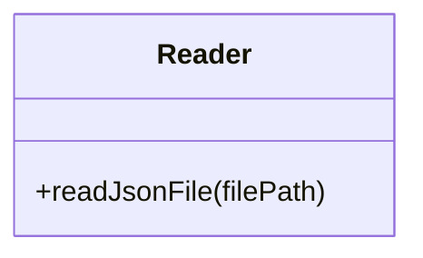
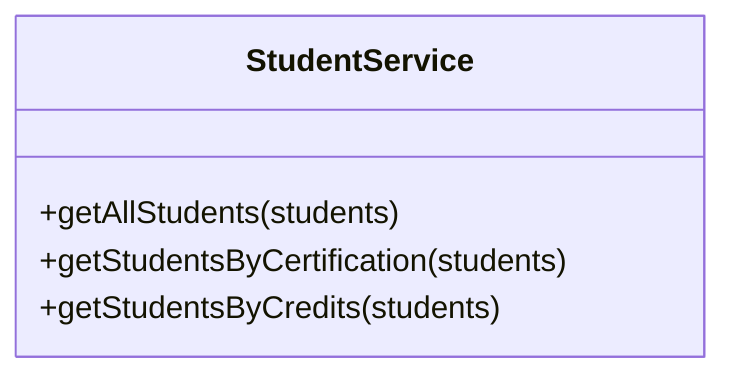
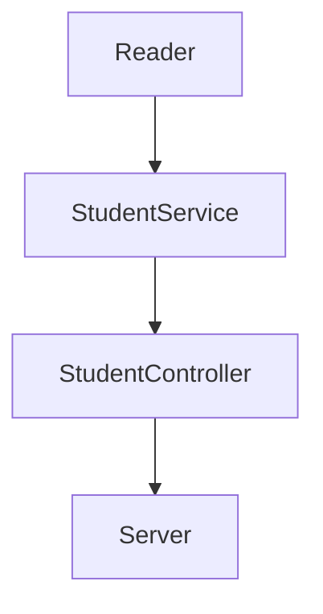

# Proyecto desarrollado para Visual Partner-Ship: Code Challenge

## Requerimientos

Los requerimientos solicitados para esta API fueron los siguientes:

1. Habilitar un endpoint para consultar todos los estudiantes con todos sus campos

2. Habilitar un endpoint para consultar los emails de todos los estudiantes que tengan certificación haveCertification.

3. Habilitar un endpoint para consultar todos los estudiantes que tengan credits mayor a 500.

### Dependencias utilizadas

- Jest: `npm install --save-dev jest`
- ESlint: `npm install --save-dev eslint`
- Express: `npm install --save express`

## Solución al code Challenge

### Configuración del entorno y dependencias

1. Creación de un proyeto JS con `npm init -y`, este comando nos creará un archivo package.json, en él se guardan las configuraciones de nuestro proyecto tales como: nombre, autor, versión, pero sobre todos nuestras dependencias necesarias para el mismo,entre otra información más.

2. Instalamos las dependencias de **Jest**, para realizar tests unitarios en el proyecto y **ESlint** para aplicar formateo al código y mantener un estilo de código en todo el proyecto.

3. Ejecutando `npm init @eslint/config` configuraremos ESlint para aplicar las reglas que queremos en nuestro código.

    ```markdown
    module.exports = {
        "env": {
            "browser": true,
            "commonjs": true,
            "es2021": true,
            "jest": true
        },
        "extends": "eslint:recommended",
        "parserOptions": {
            "ecmaVersion": "latest"
        },
        "rules": {
            indent: ["error", 4],
            "linebreak-style": ["error", "unix"],
            quotes: ["error", "double"],
            semi: ["error", "always"]
        }
    };
    ```

4. Se debe crear un archivo **.gitignore** dentro del cuál agregaremos los archivos o directorios que no queremos versionar.

    `echo "node_modules" > .gitignore`

5. Como ya se mencionó, en este proyecto se utilizan pruebas de unidad con Jest, aprovechandolas se atomatizará su revisión al hacer push a github, con github actions.

    Para ello crearemos el directorio `.github/workflows` y dentro introduciremos las siguientes instrucciones:

    ```javascript
    name: Run Tests in my project every push on GitHub
    on: [push]

    jobs:
    build:
        runs-on: ubuntu-latest
        steps:
        - uses: actions/checkout@v1
        - name: Run Jest
        uses: stefanoeb/jest-action@1.0.3
    ```

    Con esto cada vez que hagamos push a nuestro repositorio se ejecutarán las pruebas de unidad y en caso de que fallen serán notificadas en el actions de github.

6. Agregaremos scripts a nuestro archivo `package.json` para que podamos ejecutar nuestras dependencias de manera más rápida.
    Los scripts que agregaremos son los siguientes:

    ```javascript
    "scripts": {
    "test": "node ./node_modules/.bin/jest",
    "linter": "node ./node_modules/eslint/bin/eslint.js .",
    "linter-fix": "node ./node_modules/eslint/bin/eslint.js . --fix",
    "server": "node ./lib/server.js"
      },
    ```

Con esto nuestro entorno sobre el cuál trabajeremos estará listo.

### Código de la solución

Basado en los requerimientos se realizaron las siguientes clases:





y para el flujo final del proyecto y la API, con separación de responsabilidades está de la siguiente manera:



## DOCUMENTACIÓN DE LA API

La API está documentada con POSTMAN y se encuentra en el siguiente enlace: [link](https://documenter.getpostman.com/view/15722353/UyxbrqHk)

Contiene ejemplos de peticiones y respuestas del servidor.
